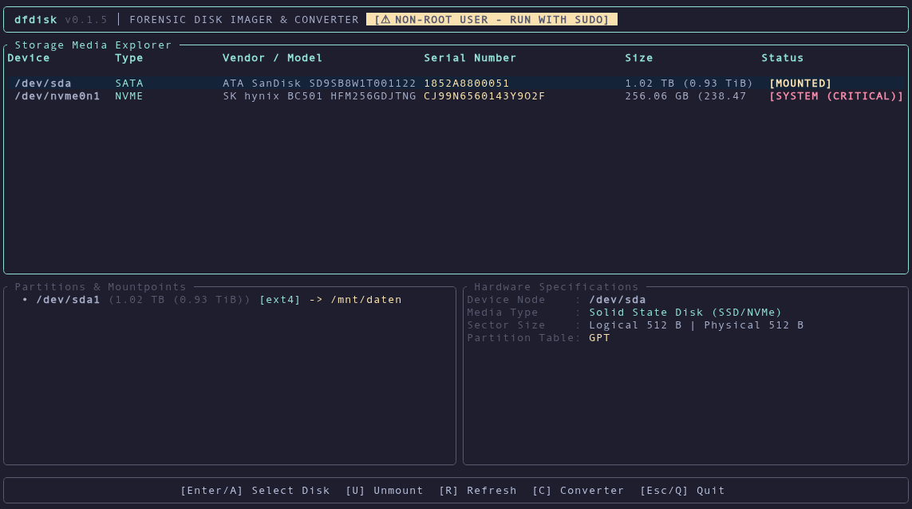
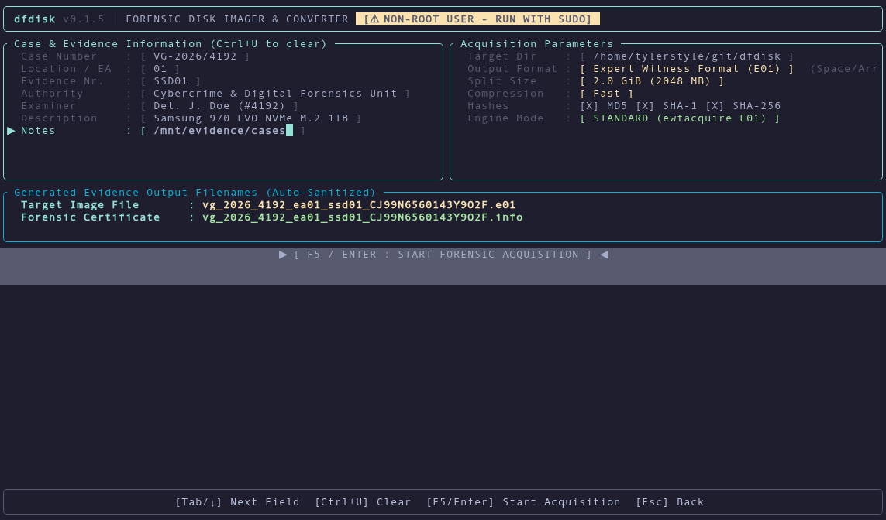
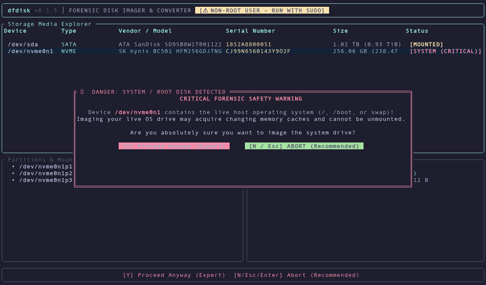
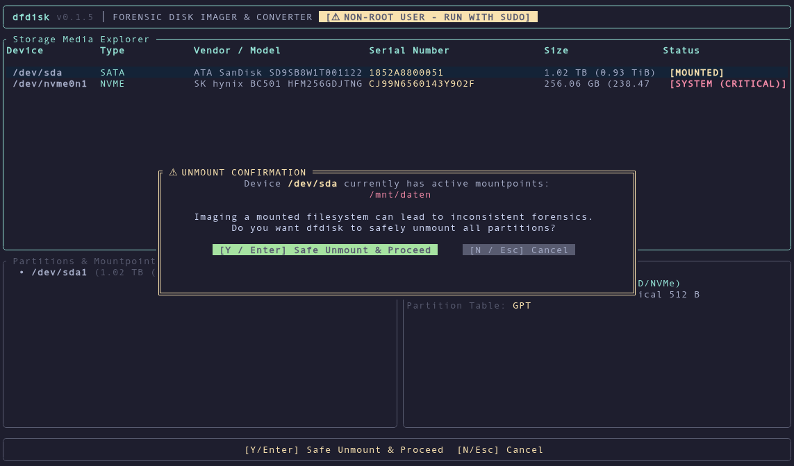
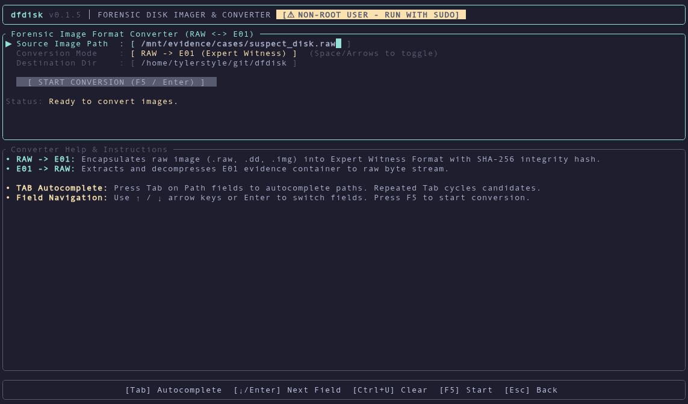

# dfdisk 🔍💾

> **Modern Forensic Disk Imaging, Damaged Media Rescue & Evidence Management CLI/TUI for Digital Forensics and Incident Response (DFIR).**

<p align="center">
  <a href="https://github.com/tylerstyle/dfdisk/releases/latest">
    
  </a>
  <a href="https://github.com/tylerstyle/dfdisk/actions/workflows/ci.yml">
    
  </a>
  <a href="https://ratatui.rs/">
    
  </a>
  <a href="https://github.com/nix-community/NUR">
    
  </a>
  <a href="#-license">
    
  </a>
</p>

`dfdisk` is a high-performance terminal tool engineered for law enforcement investigators, incident responders, and forensic analysts. It eliminates command-line complexity and human error in evidence acquisition by coupling **hardware discovery**, **active safety guardrails**, **automated forensic naming conventions**, **dual cryptographic hashing**, and **bi-directional format conversion** with an intuitive, modern terminal interface.

---

# 👤 User Guide

## 📸 Interface Tour

### 1. Storage Media Explorer & Hardware Safety Check
Inspect all connected storage buses (SATA, NVMe, USB, SCSI), view mountpoints, partition tables, disk geometry, and immediate safety indicators (`[SYSTEM (CRITICAL)]`, `[MOUNTED]`).

<p align="center">
  
</p>

### 2. Case Setup & Standardized Evidence Pipeline
Fill in case metadata to automatically generate strict, audit-compliant evidence filenames and configure acquisition settings (compression, segment splitting, multi-hash calculation).

<p align="center">
  
</p>

### 3. Critical Safety Guardrails
Never accidentally wipe or acquire an OS root partition. `dfdisk` actively monitors `/`, `/boot`, `/nix`, and active swap partitions, halting execution with clear, unmissable safeguards.

<p align="center">
  
  
</p>

### 4. Bi-Directional Format Converter with Path Autocompletion
Convert between raw byte streams (`.raw`, `.dd`, `.img`) and EnCase Expert Witness (`.E01`) containers with integrated Tab path autocompletion.

<p align="center">
  
</p>

---

## ⚡ Core Features

- **Standard Forensic E01 Acquisition**: Powered by `libewf` (`ewfacquire`) for full EnCase 6/7 compatibility, multi-threaded Deflate compression, custom segment split sizes (2 GB, 4 GB, unlimited), and bad sector zero-filling.
- **Damaged Media Rescue Mode**: Integrated `ddrescue` multi-pass engine with non-destructive `.map` logfiles for recovering failing magnetic platters and degraded flash storage.
- **Automated Evidence Naming Pipeline**: Automatically cleans and structures output filenames matching law enforcement standards:
  $$\texttt{\{case\}\_\{location/ea\}\_\{evidence\}\_\{serial\}}\mathbf{.e01}$$
  *Example:* `VG-2026/4192` + `01` + `SSD01` + `CJ99N6560143Y902F` $\rightarrow$ `vg_2026_4192_ea01_ssd01_CJ99N6560143Y902F.e01`
- **Court-Ready Forensic Certificates (`.info`)**: Writes cryptographic verification sidecars detailing source device serial numbers, logical/physical sector sizes, partition tables, SMART diagnostics, acquisition timestamps, and pre/post MD5, SHA-1, and SHA-256 hashes.
- **Zero-Accident Safety Guardrails**:
  - Live OS and root filesystem protection against overwrites or improper live acquisition.
  - One-touch safe partition unmounting (`umount`) before imaging begins.
- **Bi-Directional Format Converter**: Seamless conversion between `RAW -> E01` (injecting case headers and hash records) and `E01 -> RAW` (with streamed verification).
- **Terminal Autocompletion**: Smart shell-like Tab completion for directory and file paths with multi-candidate cycling.

---

## 📦 Installation

### 1. Nix / NixOS

#### Run Directly (Zero Install):
```bash
nix run github:tylerstyle/dfdisk
```

#### Via NUR (Nix User Repository):
`dfdisk` is officially available in the [NUR](https://github.com/nix-community/NUR):
```nix
# In your NixOS or Home Manager configuration:
environment.systemPackages = [
  config.nur.repos.tylerstyle.dfdisk
];
```

#### Flake Input:
```nix
inputs = {
  nixpkgs.url = "github:nixos/nixpkgs/nixos-unstable";
  dfdisk.url = "github:tylerstyle/dfdisk";
};
```

---

### 2. Debian / Ubuntu (`.deb`)

Download the latest `.deb` package from [GitHub Releases](https://github.com/tylerstyle/dfdisk/releases) or install via terminal:

```bash
# Download and install package
wget https://github.com/tylerstyle/dfdisk/releases/latest/download/dfdisk_amd64.deb
sudo dpkg -i dfdisk_amd64.deb
sudo apt-get install -f   # Installs runtime forensic utilities if needed
```

*Runtime dependencies included:* `libewf-tools`, `gddrescue`, `smartmontools`, `util-linux`, `udev`.

---

### 3. Arch Linux / Manjaro

Install via your preferred AUR helper:

```bash
yay -S dfdisk
# Or the development release tracking main:
yay -S dfdisk-git
```

---

### 4. Standalone Pre-compiled Binaries

Download self-contained tarballs from [GitHub Releases](https://github.com/tylerstyle/dfdisk/releases):
- `x86_64-unknown-linux-gnu`
- `x86_64-unknown-linux-musl` (Static binary)
- `aarch64-unknown-linux-gnu` (ARM64)

```bash
tar -xzvf dfdisk-*-x86_64-unknown-linux-musl.tar.gz
sudo install -m 755 dfdisk-*/dfdisk /usr/local/bin/
```

---

## 🚀 Usage & Quick Start

### 1. Interactive TUI Dashboard (Default)

Launch the visual interface with root privileges to enable raw block access:

```bash
sudo dfdisk
```

#### Keyboard Navigation:

| Screen | Keys | Action |
|---|---|---|
| **Device Explorer** | `↑` / `↓` or `j` / `k` | Navigate storage media list |
| | `Enter` / `a` | Setup acquisition for selected device |
| | `u` | Safely unmount active partitions on selected disk |
| | `r` | Rescan / refresh storage bus hardware |
| | `c` | Switch to Image Converter mode |
| | `q` / `Esc` | Quit `dfdisk` |
| **Case Setup** | `Tab` / `↓` | Next input field |
| | `Shift+Tab` / `↑` | Previous input field |
| | `←` / `→` / `Space` | Toggle options (Format, Split Size, Compression, Hashes, Engine) |
| | `Ctrl+U` | Clear current text field |
| | `F5` / `Enter` on button | Start forensic acquisition |
| | `Esc` | Return to Device Explorer |
| **Image Converter** | `Tab` | Autocomplete directory or filename path |
| | `Ctrl+U` | Clear current path |
| | `Space` / `←` / `→` | Toggle RAW $\rightarrow$ E01 or E01 $\rightarrow$ RAW |
| | `F5` / `Enter` on button | Execute conversion |
| | `Esc` | Return to Device Explorer |

---

### 2. CLI Automation & Scripting

`dfdisk` offers full scriptability for automated forensic triage and lab pipelines:

#### Probe & List Devices (Human or JSON):
```bash
dfdisk list
dfdisk list --json
```

#### Acquire Drive to E01 Evidence Image:
```bash
sudo dfdisk acquire /dev/sdb \
  --case "VG-2026/4192" \
  --ea "01" \
  --evidence "SSD01" \
  --examiner "Det. J. Doe (#4192)" \
  --authority "Cybercrime Division" \
  --description "Suspect Samsung NVMe SSD" \
  --output-dir /mnt/evidence/cases/ \
  --format e01 \
  --split 2G \
  --compression fast \
  --auto-unmount
```

#### Rescue Damaged Drive (`ddrescue` Multi-Pass):
```bash
sudo dfdisk acquire /dev/sdc \
  --case "VG-2026/4192" \
  --evidence "HDD02" \
  --rescue \
  --output-dir /mnt/evidence/cases/
```

#### Convert Images (RAW $\leftrightarrow$ E01):
```bash
# RAW to E01
dfdisk convert /mnt/evidence/image.raw --to e01 --case "VG-2026/4192" --evidence "HDD02" -o /mnt/evidence/

# E01 to RAW
dfdisk convert /mnt/evidence/evidence.E01 --to raw -o /mnt/evidence/
```

#### Cryptographic Hash Verification:
```bash
dfdisk verify /mnt/evidence/evidence.E01 --md5 43a4195f3e626bdf70a5d6652e1a389a
```

---

## 📜 Forensic Certificate Sample (`.info`)

Every acquisition automatically creates a cryptographic proof-of-work documentation sidecar:

```text
================================================================================
                         DFDISK FORENSIC ACQUISITION REPORT
================================================================================

[CASE INFORMATION]
Case Number         : VG-2026/4192
Location / EA       : 01
Evidence Number     : SSD01
Authority / Agency  : Cybercrime & Digital Forensics Unit
Examiner            : Detective J. Doe (#4192)
Description         : Samsung 970 EVO NVMe M.2 1TB

[SOURCE HARDWARE SPECIFICATIONS]
Device Node         : /dev/nvme0n1
Vendor / Model      : Samsung SSD 970 EVO Plus 1TB
Serial Number       : S4GFNX0T501075E
Bus Interface       : NVMe
Media Type          : Solid State Disk (SSD/NVMe)
Sector Size         : Logical: 512 bytes | Physical: 512 bytes
Total Sectors       : 1953525168 sectors
Total Capacity      : 1000204886016 bytes (1.00 TB (931.51 GiB))

[ACQUISITION CONFIGURATION]
Acquisition Tool    : dfdisk v0.1.6
Output Format       : Expert Witness Format (E01)
Compression         : Fast (Deflate)
Segment Split Size  : 2.0 GiB (2048 MB)
Error Handling      : Retries: 2 | Wipe bad sectors: Yes (Zero-fill)

[ACQUISITION TIMESTAMPS & PERFORMANCE]
Started             : 2026-09-15 08:30:00 UTC
Ended               : 2026-09-15 08:44:12 UTC
Elapsed Time        : 00:14:12
Average Speed       : 117.38 MB/s
Bad / Error Sectors : 0 sectors

[CRYPTOGRAPHIC INTEGRITY & VERIFICATION]
Source MD5          : a5ff1a52a6b027b00a1920ef7a4a55ce
Source SHA-256      : b630a52bcab287e6484bcc45124c3031513534db469d72f4a0574d6d009bb287

Image MD5           : a5ff1a52a6b027b00a1920ef7a4a55ce
Image SHA-256       : b630a52bcab287e6484bcc45124c3031513534db469d72f4a0574d6d009bb287

Verification Result : VERIFIED - ALL HASHES MATCH (Acquisition Integrity Confirmed)

[GENERATED EVIDENCE FILES]
 - /mnt/evidence/cases/vg_2026_4192_ea01_ssd01_S4GFNX0T501075E.e01
 - /mnt/evidence/cases/vg_2026_4192_ea01_ssd01_S4GFNX0T501075E.info
================================================================================
```

---

# 🛠️ Developer & Architecture Guide

## 🏗️ Architecture Overview

The codebase is organized into clean, isolated modules separating hardware interactions from presentation logic:

```
src/
├── main.rs                 # CLI entrypoint, subcommand routing & signal handling
├── cli/                    # Clap v4 argument definition and parsing
├── discovery/              # Hardware inspection & safety verification
│   ├── devices.rs          # Block device enumeration (sysfs, lsblk, udev)
│   ├── safety.rs           # Guardrails (mount detection, OS root protection, swap scanning)
│   └── smart.rs            # S.M.A.R.T. health and temperature diagnostic parser
├── engines/                # Forensic execution backends
│   ├── ewf.rs              # libewf wrapper (ewfacquire, ewfexport)
│   ├── rescue.rs           # GNU ddrescue engine with mapfile progress tracking
│   ├── converter.rs        # Bi-directional RAW <-> E01 conversion routines
│   └── hasher.rs           # Multi-threaded streaming MD5, SHA-1, SHA-256 hasher
├── models/                 # Domain types and evidence naming pipelines
│   ├── case.rs             # Case metadata, sanitization & forensic file naming
│   └── device.rs           # BlockDevice, Partition, and HardwareSpec structs
└── tui/                    # Ratatui Terminal Interface
    ├── app.rs              # Application state machine, key handlers & event loop
    ├── ui.rs               # Terminal UI widget rendering, layouts, and styles
    └── autocomplete.rs     # Path autocompletion, cycling, and prefix algorithms
```

---

## 🧩 Dependencies & Open Source Ecosystem

`dfdisk` stands on the shoulders of open-source projects across the Rust and forensic systems ecosystems:

### Core Frameworks
| Dependency | Badge / Reference | Purpose |
|---|---|---|
| **Ratatui** | [](https://ratatui.rs/) | Delicious terminal user interface library powering all dashboard views, modals, and telemetry gauges. |
| **Crossterm** | [crossterm-rs/crossterm](https://github.com/crossterm-rs/crossterm) | Cross-platform terminal control (raw mode, keyboard input, terminal alternate screens). |
| **Clap** | [clap-rs/clap](https://github.com/clap-rs/clap) | Robust command-line argument parser providing both CLI subcommands and flag validation. |
| **Tokio** | [tokio-rs/tokio](https://tokio.rs/) | Asynchronous runtime powering concurrent disk telemetry, timers, and streaming subprocess monitors. |

### Cryptographic & System Utilities
- **[RustCrypto](https://github.com/RustCrypto)** (`sha2`, `sha1`, `md-5`): Pure Rust implementations of cryptographic hashing algorithms with hardware acceleration.
- **[libewf / ewf-tools](https://github.com/libyal/libewf)**: The reference open-source implementation for EnCase Expert Witness Compression Format (`.E01`).
- **[GNU ddrescue](https://www.gnu.org/software/ddrescue/)**: Specialized data recovery algorithm designed to copy damaged sectors without degrading media.
- **[smartmontools](https://www.smartmontools.org/)**: Standard utility suite for querying disk S.M.A.R.T. health and temperature attributes.
- **[util-linux](https://github.com/util-linux/util-linux)**: Linux core system utilities (`lsblk`, `blockdev`, `umount`).
- **[Chrono](https://github.com/chronotope/chrono)**: ISO 8601 timestamps and audit logs.
- **[Indicatif](https://github.com/console-rs/indicatif)**: CLI progress rendering.

---

## 💻 Local Development Setup

### Using Nix (Hermetic Dev Environment)

The easiest way to develop `dfdisk` is using the provided `shell.nix`:

```bash
git clone https://github.com/tylerstyle/dfdisk.git
cd dfdisk

# Spawns a shell containing rustc, cargo, rustfmt, clippy, libewf, ddrescue, smartctl, etc.
nix-shell
```

Or using Flakes:
```bash
nix develop
```

---

### Standard Linux Toolchain

On Debian/Ubuntu:
```bash
sudo apt-get update
sudo apt-get install -y build-essential pkg-config \
  libewf-dev libewf-tools gddrescue smartmontools util-linux udev
```

On Arch Linux:
```bash
sudo pacman -S --needed base-devel pkgconf libewf ddrescue smartmontools util-linux
```

---

## 🧪 Testing & Verification

`dfdisk` enforces rigorous test coverage across hardware discovery, name sanitization, and forensic safety logic:

```bash
# Run all unit and integration tests (158+ tests)
cargo test --verbose

# Run clippy with strict warnings
cargo clippy --all-targets -- -D warnings

# Verify formatting
cargo fmt --check

# Test build with Nix
nix-build
```

### Key Test Suites:
- `case_naming_test.rs`: Validates sanitization against directory traversals, whitespace, non-ASCII Unicode, and punctuation.
- `discovery_test.rs`: Validates partition tree discovery, NVMe/SATA bus identification, and active vs dormant swap detection.
- `safety_test.rs`: Ensures OS root (`/`), `/boot`, `/nix`, and active swap partitions can never be bypassed without explicit acknowledgment.
- `hashing_test.rs`: Validates streaming hashes against standard RFC test vectors.
- `engine_robustness_test.rs`: Verifies hash matching matrix and truthful reporting during damaged media rescue.

---

## ⚖️ License

`dfdisk` is dual-licensed under either:

- **MIT License** ([LICENSE-MIT](LICENSE-MIT) or <https://opensource.org/licenses/MIT>)
- **Apache License, Version 2.0** ([LICENSE-APACHE](LICENSE-APACHE) or <https://www.apache.org/licenses/LICENSE-2.0>)

at your option.

---

## ⚖️ Legal, Forensic & Trademark Disclaimers

### 1. Forensic Tool Validation & Chain of Custody
`dfdisk` provides forensic bit-stream imaging, damaged media rescue, evidence container conversion, and cryptographic verification designed in alignment with NIST Computer Forensic Tool Testing (CFTT) standards. However, because digital forensics, criminal casework, and electronic discovery are governed by rigorous legal and chain-of-custody requirements:
- **Examiner Responsibility**: Forensic practitioners, law enforcement officers, and incident responders remain solely responsible for validating their hardware write-blockers, storage bus interfaces, host environments, and software toolchains in accordance with applicable standards (e.g., **ISO/IEC 17025**, **ISO/IEC 27037**, **ASTM E3016**) and jurisdiction-specific rules of evidence before deploying `dfdisk` on live casework or evidence media.
- **Limitation of Liability**: THIS SOFTWARE IS PROVIDED "AS IS", WITHOUT WARRANTY OF ANY KIND, EXPRESS OR IMPLIED, INCLUDING BUT NOT LIMITED TO THE WARRANTIES OF MERCHANTABILITY, FITNESS FOR A PARTICULAR PURPOSE, EVIDENCE INTEGRITY, AND NONINFRINGEMENT. IN NO EVENT SHALL THE AUTHORS OR COPYRIGHT HOLDERS BE LIABLE FOR ANY CLAIM, DAMAGES, LOSS OF EVIDENCE, HARDWARE FAILURE, DATA CORRUPTION, OR OTHER LIABILITY, WHETHER IN AN ACTION OF CONTRACT, TORT OR OTHERWISE, ARISING FROM, OUT OF OR IN CONNECTION WITH THE SOFTWARE OR THE USE OR OTHER DEALINGS IN THE SOFTWARE.

### 2. Trademarks & Nominative Fair Use
All trademarks, product names, logos, and brands mentioned in this repository are the property of their respective owners:
- **EnCase®** and **E01** (Expert Witness Compression Format) are trademarks or registered trademarks of OpenText Corporation (formerly Guidance Software).
- **Linux®** is a registered trademark of Linus Torvalds.
- **Ratatui** is an open-source project licensed under MIT / Apache-2.0.
- **libewf** is an open-source library maintained by Joachim Metz and the libyal project.
- **GNU ddrescue** is an open-source utility developed under the GNU General Public License.

Their use within `dfdisk` documentation and software is strictly for **nominative identification, compatibility description, and technical interoperability** (e.g., referencing support for Expert Witness `.E01` evidence images or integration with system utilities). `dfdisk` is an independent open-source project and is not affiliated with, sponsored by, authorized by, or endorsed by OpenText Corporation or any of the trademark owners listed above.
